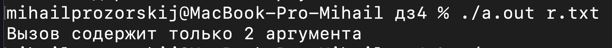
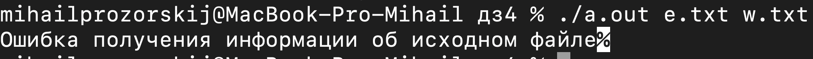
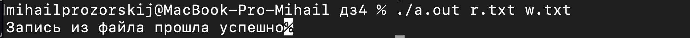

# OS_files
# Прозорский Михаил Алексеевич
## БПИ224

Работа выполнена на 9 баллов

### Описание:
1. Проверяем исходный файл
2. Пытаемся открыть файлы
3. Записываем в файл циклом
4. Закрываем файлы

### Тесты:
1. количество аргументов не равно 2:

2. Некорректный исходный файл:

3. Все успешно:

